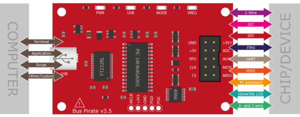

# Bus Pirate




## Firmwares

* [BusPirate/Bus_Pirate](https://github.com/BusPirate/Bus_Pirate)
    ```powershell
    cd Bus_Pirate/package/BPv4-firmware/pirate-loader-v4-source/pirate-loader_lnx
    sudo ./pirate-loader_lnx --dev=/dev/ttyACM0 --hex=../BPv4-firmware-v6.3-r2151.hex
    ```


## Examples

Dump firmware over SPI using a Bus Pirate

```powershell
# Identify EEPROM chip
sudo flashrom -p buspirate_spi:dev=/dev/ttyUSB0

# Dump firmware using a bus pirate (SPI)
sudo flashrom -p Buspirate_spi:dev=/dev/ttyUSB0,spispeed=1M -c (Chip name)  -r (Name.bin)
```


## References

* [Bus Pirate Unboxing - Toolkit - Hacker Warehouse - 4 juin 2018](https://youtu.be/lP8vMvBu3Bg)
* [Bus Pirate 5 REV 10 Hardware](https://hardware.buspirate.com/)
* [Ph0wn, my first IoT CTF - Part 2 - Sebastien Andrivet - 19 December 2018](https://sebastien.andrivet.com/fr/posts/ph0wn-my-first-iot-ctf-part-2/)
* [Hardware Hacking: Plunder With a Bus Pirate - Brian Berg - February 15, 2024](https://trustedsec.com/blog/hardware-hacking-plunder-with-a-bus-pirate)