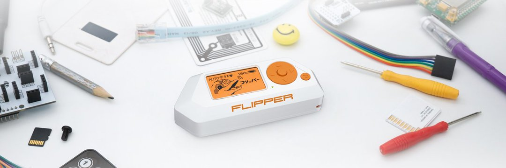

# Flipper Zero



## Firmwares

* [Flipper Zero Firmware](https://github.com/flipperdevices/flipperzero-firmware)
* [Flipper Zero Unleashed Firmware](https://github.com/Eng1n33r/flipperzero-firmware)
* [Flipper Zero FW RogueMaster](https://github.com/RogueMaster/flipperzero-firmware-wPlugins)
* [Flipper Zero Xtreme-Firmware](https://github.com/Flipper-XFW/Xtreme-Firmware)
* [Flipper Zero Momentum-Firmware](https://github.com/Next-Flip/Momentum-Firmware)


### Firmware Update - PC

1. Update to the latest firmware using [https://flipperzero.one/update](https://flipperzero.one/update)
2. Download and install qFlipper
3. Connect your Flipper Zero via USB, update to the official firmware
4. Disconnect from USB, power off the Flipper Zero, and remove the SD to prepare it for flashing.
5. Download the latest [RogueMaster](https://github.com/RogueMaster/flipperzero-firmware-wPlugins) firmware from their Github Page. 
6. Unzip the downloaded .zip and copy the content into /update of the Flipper SD card (including the .dfu)
7. On the Flipper Zero, once booted, press down, and left until you are on the 'Browser' screen. Scroll down until you see the 'update' directory and click on it.
8. You should now see the contents you uploaded and an 'update' option. Hover over the 'update' option, click the center button on your Flipper, once again on the 'Run in App' option.


### Firmware Update - WebUpdater

* [DarkFlippers/unleashed-firmware - Web Update](https://lab.flipper.net/?url=https://unleashedflip.com/fw_extra_apps/flipper-z-f7-update-unlshd-038e.tgz&channel=release-cfw&version=unlshd-038e)
* [RogueMaster/flipperzero-firmware-wPlugins - Web Update](https://lab.flipper.net/?url=https%3A%2F%2Frogue-master.net%2F%3Ffile%3DRM0322-1504-0.79.2-22158b0.tgz&channel=RM0322-1504-0.79.2-22158b0&version=0.79.2)


## GPIO


## Videos

* [Flipper Zero: Want some good news? - Penthertz](https://www.youtube.com/watch?v=tB0eYatvu0k)
* [Flipper Zero: is this for you? Follow our 1st tests! - Penthertz](https://www.youtube.com/watch?v=W5YYObSBUno)
* [Flipper Zero: french collection video on the Flipper Zero, tutorial and explain](https://www.youtube.com/playlist?list=PLq_UnUtYZ15eoAiElH4T2XEB29iwZSi5a)


## Tutorials and Resources

* [Flipper Zero Hacking 101 - pingywon](https://flipper.pingywon.com/flipper/)
* [Flipper Zero Playground - UberGuidoZ](https://github.com/UberGuidoZ/Flipper)
* [Flashing Flipper Zero with RogueMaster CFW](https://interestingsoup.com/n00b-guide-flashing-flipper-zero-to-rougemaster/)
* [Unleashed Firmware - Update firmware](https://github.com/DarkFlippers/unleashed-firmware/blob/dev/documentation/HowToInstall.md)


## IOC

[MAC addresses](https://standards-oui.ieee.org/oui/oui.txt) from IEEE for Flipper Zero: `0C:FA:22:XX:XX:XX`.   
This applies to Bluetooth, Ethernet, WiFi interfaces.

```ps1
0C-FA-22   (hex)     FLIPPER DEVICES INC
0CFA22     (base 16) FLIPPER DEVICES INC
                     2803 Philadelphia Pike Suite B #551
                     Claymont    19703
                     US
```


## References

* [The Ultimate Guide / CheatSheet to Flipper Zero - Ilias Mavropoulos - 17/01/2024](https://infosecwriteups.com/the-ultimate-guide-cheatsheet-to-flipper-zero-d4c42d79d32c)
* [djsime1/Awesome FlipperZero - 🐬 A collection of awesome resources for the Flipper Zero device](https://github.com/djsime1/awesome-flipperzero)
* [Reading NFC cards - Flipper Docs](https://docs.flipper.net/nfc/read)