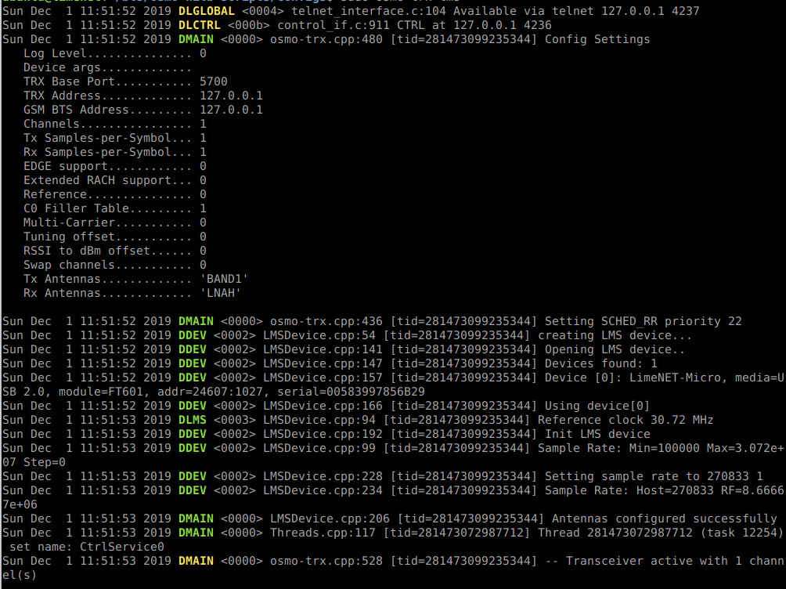
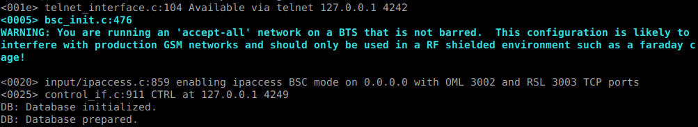
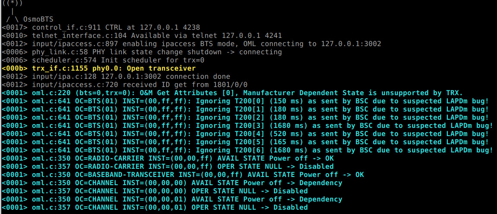
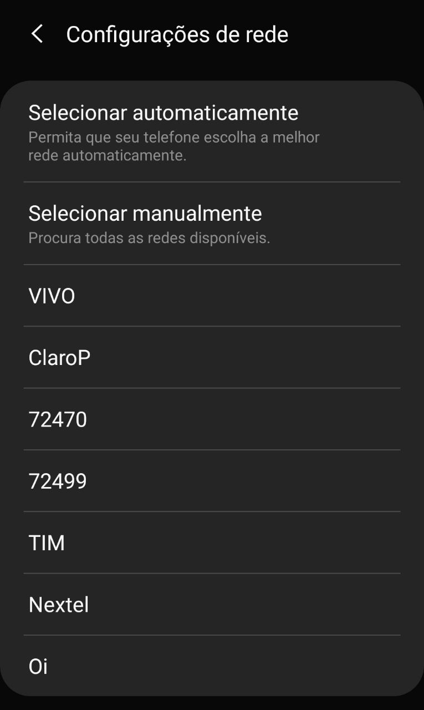

# GSM Network: LimeSDR

**DISCLAIMER**: This procedure is highly illegal basically anywhere in the world. Be sure to run this in a closed RF environment (also know as Faraday Cage)


* [Running a GSM Station with osmo network-in-a-box (sms/audio)](#running-a-gsm-station-with-osmo-network-in-a-box)
* Running a GSM Station with full osmo (sms/audio/data) [TODO]


### Running a GSM Station with osmo network-in-a-box

For this example we will use the Osmocom GSM Stack in the NITB (Network in the box) mode. In this mode the phones connected to you BTS will be able to call each other and send SMS messages. There is also the Interconnect mode in which the BSC (Base Station Controller) connects to a ISDN or IPBX (for example Asterisk) to manage the connected phones. You can check the different modes here: [https://osmocom.org/projects/openbsc/wiki/OpenBSC#Configurations-Modes](https://osmocom.org/projects/openbsc/wiki/OpenBSC#Configurations-Modes)

For this article I will be using a Ubuntu 18.04 LTS as operating system since there are pre-compiled packages from [LimeMicro](https://limemicro.com/) that helps a lot. It should run in any linux distribution provided that it has the required packages and / or you compile the missing ones. I might make a tutorial later about how to install from the source code but for now I will stick to the pre-compiled packages.

## Installing the required packages

The first thing we need to do is to install all required packages. LimeMicro did a nice work and gathered everything pre compiled in their PPAs. So let’s add them first:

```bash
sudo add-apt-repository -y ppa:myriadrf/drivers
sudo add-apt-repository -y ppa:myriadrf/gnuradio
```

Let’s also add the osmocom binary builds:

```bash
wget https://download.opensuse.org/repositories/network:/osmocom:/latest/xUbuntu_18.04/Release.key
sudo apt-key add Release.key
rm Release.key
echo "deb [https://download.opensuse.org/repositories/network:/osmocom:/latest/xUbuntu_18.04/](https://download.opensuse.org/repositories/network:/osmocom:/latest/xUbuntu_18.04/) ./" | sudo tee /etc/apt/sources.list.d/osmocom-latest.list
sudo apt-get update
```

Then we can install required packages:

```bash
sudo apt install osmocom-nitb osmo-trx-lms osmo-bts-trx limesuite
```

These packages are:

* `osmocom-nitb` => Network in a Box Package. Contains all needed stuff for managing GSM Network
* `osmo-bts-trx` => The Base Transceiver Station software that manages how the network packets will be sent.
* `osmo-trx-lms` => The LimeSDR “frontend” for the BTS. This is the piece of software that actually communicates with LimeSDR
* `limesuite` => The software and driver for the LimeSDR

## Updating the LimeSDR Firmware

It is a good pratice to check if your LimeSDR firmware is up to date. To check and update if needed, you only need to run:

```bash
LimeUtil --update
```

It should do everything that is needed to update

## Creating the configuration files

There are few files that need to be created. Let’s first start with the OpenBSC config file *openbsc.cfg*:

```
!
! OpenBSC configuration saved from vty
!   !
password foo
!
line vty
 no login
!
e1_input
 e1_line 0 driver ipa
network
 network country code 901
 mobile network code 70
 short name HUEHUE
 long name HUEBRNetwork
 auth policy accept-all
 location updating reject cause 13
 encryption a5 0
 neci 1
 rrlp mode none
 mm info 1
 handover 0
 handover window rxlev averaging 10
 handover window rxqual averaging 1
 handover window rxlev neighbor averaging 10
 handover power budget interval 6
 handover power budget hysteresis 3
 handover maximum distance 9999
 bts 0
  type sysmobts
  band GSM900
  cell_identity 0
  location_area_code 1
  training_sequence_code 7
  base_station_id_code 63
  ms max power 15
  cell reselection hysteresis 4
  rxlev access min 0
  channel allocator ascending
  rach tx integer 9
  rach max transmission 7
  ip.access unit_id 1801 0
  oml ip.access stream_id 255 line 0
  gprs mode none
  trx 0
   rf_locked 0
   arfcn 100
   nominal power 23
   max_power_red 20
   rsl e1 tei 0
   timeslot 0
    phys_chan_config CCCH+SDCCH4
   timeslot 1
    phys_chan_config SDCCH8
   timeslot 2
    phys_chan_config TCH/F
   timeslot 3
    phys_chan_config TCH/F
   timeslot 4
    phys_chan_config TCH/F
   timeslot 5
    phys_chan_config TCH/F
   timeslot 6
    phys_chan_config TCH/F
   timeslot 7
    phys_chan_config TCH/F
```
There are several parameters here, but I will only describe the ones you might want to change:

```
network country code 901
mobile network code 70
short name HUEHUE
long name HUEBRNetwork
auth policy accept-all
```

* `network country code` => That is the MCC of the network operator. It says in which country the operator is operating. For example: 724 is Brazil
* `mobile network code` => That is the MNC of the network operator. It says which network operator it is. Every mobile network operator has its own MNC (some of them have more than one).
* `short name` => The Short name of the network operator
* `long name` => The Long Name of the network operator
* `auth policy` => How we will accept the phones that are trying to connect.

Be careful setting these settings specially with a **accept-all** policy. If you set to an existing mobile operator, any phone that is close to your LimeSDR will connect to it. The names of the operator (at least in a Android Device) only appears after connecting to it.

That **openbsc.cfg** file will be used by **osmo-nitb** software. The next file is **osmo-bts.cfg**

```
!
! OsmoBTS configuration example
!!
!
log stderr
  logging color 1
  logging timestamp 0
  logging level rsl notice
  logging level oml notice
  logging level rll notice
  logging level rr notice
  logging level loop debug
  logging level meas debug
  logging level pag error
  logging level l1c error
  logging level l1p error
  logging level dsp error
  logging level abis error

!
line vty
 no login
!
phy 0
 instance 0
  osmotrx rx-gain 40
  osmotrx tx-attenuation 50
 osmotrx ip local 127.0.0.1
 osmotrx ip remote 127.0.0.1
 no osmotrx timing-advance-loop
bts 0
 oml remote-ip 127.0.0.1
 ipa unit-id 1801 0
 gsmtap-sapi pdtch
 gsmtap-sapi ccch
 band 900
 trx 0
  phy 0 instance 0
```

The only importante parameter here to take care is **band**. Make sure is the same as in *openbsc.cfg* file. The next one is *osmo-trx.cfg* which will be used by *osmo-trx-lms:*

```
log stderr
 logging filter all 1
 logging color 1
 logging print category 1
 logging timestamp 1
 logging print file basename
 logging level set-all info
!
line vty
 no login
!
trx
 bind-ip 127.0.0.1
 remote-ip 127.0.0.1
 base-port 5700
 egprs disable
 tx-sps 4
 rx-sps 4
 rt-prio 18
 chan 0
  tx-path BAND1
  rx-path LNAW
```

There are not much to change here. If you’re using a multi-port LimeSDR (like LimeSDR USB or PCIe) you can change the parameter *tx-path* and *rx-path *to the desired paths.

## Running the software stack

There are a few programs to run to get the BTS working. You should run all of them from the folder you created the configuration files.

The first one we should run is osmo-trx-lms . This one should be ran as root to enable high priority scheduling (specially needed if you’re running a small SBC like a Raspberry PI).

```bash
sudo osmo-trx-lms
```



The second one is the osmo-nitb which is the base station controller. This one doesn’t need to be ran as root.

```bash
osmo-nitb
```



And the last software is the osmo-bts-trx which handles the transceiver:

```bash
osmo-bts-trx
```



Now your base station should be running.

## Testing the Base Station

The best way to test is to have a custom simcard like this one:

](../assets/limebts/0_pKv_npHA_3DhtIQi.jpg)

But since we set the BTS to *accept-all* mode, you can just go to your phone network settings and select the created network. That will work fine if you have an Android phone which allows you to select custom networks:



Here is the network I just created with MCC 724 and MNC 70. In some simcards it is required that the MCC is the same as sim country (for example here it only shows if the network is at 724).

After connecting to the network, the name should appear instead of the MCC+MNC code:


## Listing Subscribers

There is a simple python script to list the subscribers. What it does is to open the sqlite database and do a simple query and print.

```python
#!/usr/bin/env python
import sqlite3

HLR_DATABASE = "hlr.sqlite3"
db = sqlite3.connect(HLR_DATABASE)
c = db.cursor()
c.execute("SELECT * FROM Subscriber")

print "ID\t\tcreated\t\tIMSI\t\t\tTMSI\t\textension\n"
while 1:
    subscriber = c.fetchone()
    if not subscriber:
        break

    print "{0:1}\t{1:2}\t{2:<15}\t\t{3:<10}\t{4}".format(
            subscriber[0],
            subscriber[1],
            subscriber[3],
            subscriber[7],
            subscriber[5]
            )

db.close()
```

The IMSI field is unique to that phone / simcard combination. That’s the number you can use to track a specific user around the world. The extension is the assigned phone number for that specific phone.

## Sending SMS

There are two scripts I found in the internet to send SMS. They basically selects the IMSI from the sqlite database the Osmo stack creates and then connects through the telnet interface to issue the desired commands. One of them is *sms_broadcast.py*:

```python
#!/usr/bin/env python
import telnetlib
import sqlite3
import sys

imsi = 999999999999999
HLR_DATABASE = "hlr.sqlite3"

def check_extension(extension):
    conn.write(b"show subscriber extension %s\n" % extension)
    res = conn.read_until(b"OpenBSC> ")

    if b"No subscriber found for extension" in res:
        create_subscriber(extension)

def create_subscriber(extension):
    print("No user with excension %s found. Creating new..." % extension)
    print("Extension: %s, IMSI: %d" % (extension, imsi))

    conn.write(b"show subscriber imsi %d\n" % imsi)
    res = conn.read_until(b"OpenBSC> ")

    if b"No subscriber found for imsi" in res:
        conn.write(b"subscriber create imsi %d\n" % imsi)
        conn.read_until(b"OpenBSC> ")

    conn.write(b"enable\n")
    conn.read_until(b"OpenBSC# ")
    conn.write(b"subscriber imsi %d extension %s\n" % (imsi, extension))
    conn.read_until(b"OpenBSC# ")
    conn.write(b"disable\n")
    conn.read_until(b"OpenBSC> ")

def get_users():
    # returns user id list generator

    db = sqlite3.connect(HLR_DATABASE)
    c = db.cursor()
    c.execute("SELECT * FROM Subscriber")

    for subscriber in c.fetchall():
        yield subscriber[0]

def send_sms(id, extension, message):
    conn.write(b"subscriber id %d sms sender extension %s send %s\n" % (id, extension, message))
    res = conn.read_until(b"OpenBSC> ")
    if b"%" in res:
        print(res)
        exit(1)

if __name__ == "__main__":
    try:
        extension = sys.argv[1]
        message = " ".join(sys.argv[2:])
    except:
        print("usage: ./sms_broadcast.py extension message")
        print("This script sends a message from the specified extension (number) to all devices connected to this base station")
        exit(1)

    conn = telnetlib.Telnet("127.0.0.1", 4242)
    conn.read_until(b"OpenBSC> ")

    check_extension(extension)

    for id in get_users():
        send_sms(id, extension, message)
```

This one is pretty simple to use:

```bash
python sms_broadcast.py "source number" "message"
```
This will send an SMS to **all** connected devices as it was the *source number*.

Another option is to target a single user:

```python

#!/usr/bin/env python
import telnetlib
import sys
import random
import time

imsi = 999999999999999

def check_extension(extension):
    conn.write(b"show subscriber extension %s\n" % extension)
    res = conn.read_until(b"OpenBSC> ")

    if b"No subscriber found for extension" in res:
        print("Phone with extension %s not found ;(" % extension)
        exit(1)

def check_spam_subscriber():
    conn.write(b"show subscriber imsi %d\n" % imsi)
    res = conn.read_until(b"OpenBSC> ")

    if b"No subscriber found for imsi" in res:
        conn.write(b"subscriber create imsi %d\n" % imsi)
        print(conn.read_until(b"OpenBSC> "))

def send(extension, spam_number, message):
    print("Sending sms from %d..." % spam_number)

    conn.write(b"enable\n")
    conn.read_until(b"OpenBSC# ")
    conn.write(b"subscriber imsi %d extension %d\n" % (imsi, spam_number))
    conn.read_until(b"OpenBSC# ")
    conn.write(b"disable\n")
    conn.read_until(b"OpenBSC> ")

    conn.write(b"subscriber extension %s sms sender extension %d send %s\n" % (extension, spam_number, message))
    res = conn.read_until(b"OpenBSC> ")

    if b"%" in res:
        print(res)
        exit(1)

if __name__ == "__main__":
    try:
        extension = sys.argv[1]
        repeats = int(sys.argv[2])
        message = " ".join(sys.argv[3:])
    except:
        print("usage: ./sms_spam.py extension [num of repeats] message")
        print("This script sends a message to specified number")
        exit(1)

    conn = telnetlib.Telnet("127.0.0.1", 4242)
    conn.read_until(b"OpenBSC> ")

    check_extension(extension)
    check_spam_subscriber()

    for _ in range(repeats):
        spam_number = random.randint(1000,9999)
        send(extension, spam_number, message)
        time.sleep(2)
```

This one generates a random source number and sends the specified message **n** times.

```bash
python sms_spam.py "target number" "number of times" "message"
```

### References

* [Creating your own GSM Network with LimeSDR](https://lucasteske.dev/2019/12/creating-your-own-gsm-network-with-limesdr/)
* [OpenBSC: Configuration Modes](https://osmocom.org/projects/openbsc/wiki/OpenBSC#Configurations-Modes)
* [osmobsc vty reference](https://ftp.osmocom.org/docs/latest/osmobsc-vty-reference.pdf)
* [LimeSDR](https://limemicro.com/)
* [Sysmocom Custom Simcard](http://shop.sysmocom.de/products/sysmousim-sjs1-4ff)